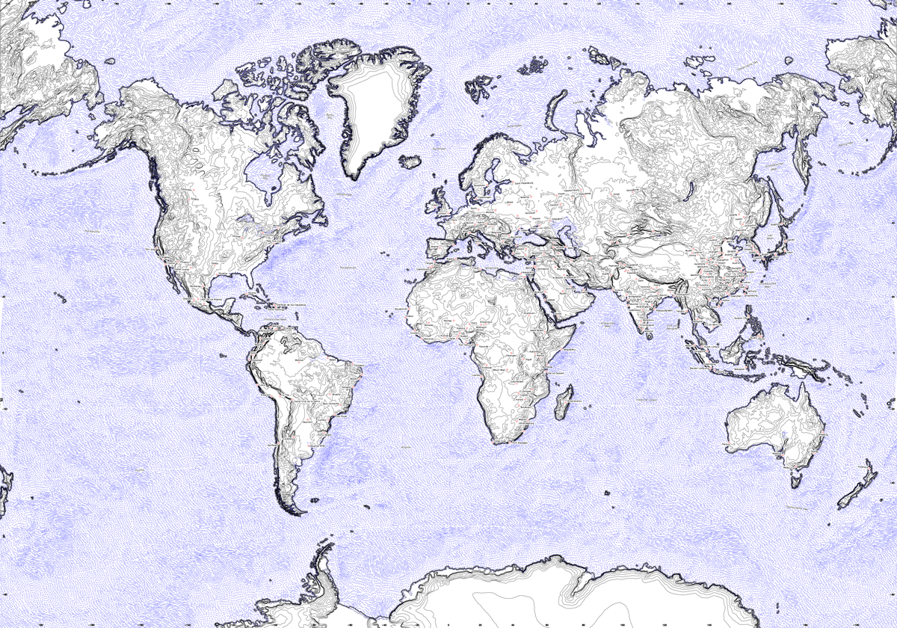

# Plotmap: a line-based world map generator

Create vector line (world) maps suitable for pen plotters. Data sources include [GEBCO](https://www.gebco.net/) elevation data 
and [OpenStreetMap coastlines](https://osmdata.openstreetmap.de/data/coastlines.html).

> [!WARNING]
> This project is still work in progress and does not yet work out of the box



### Prerequisites

* Postgres including postGIS
* Python >= 3.12
* ~30 GB of disk space
* psycopg requires libpq

### Run

1) Create a new postgres database and enable postGIS.

2) Enter the database URI to the config file `configs/config.toml`

3) Download the Hershey font file:
`curl https://gitlab.com/oskay/svg-fonts/-/raw/master/fonts/Hershey/HersheySans1.svg --create-dirs -o fonts/HersheySans1.svg` 

3) Build a map with a rather small config file:   
```python3 lineworld/run.py```  
This may take a while to download the GEBCO elevation data. 

4) Convert the output SVG to gcode files, layer by layer:  
```python3 svgtogcode.py Lineworld750x500.svg```

### Learn more:

You can find more info in a blog post about how this came to be: [A Giant Map drawn with a Pen](https://volzo.de/posts/plottermap/)